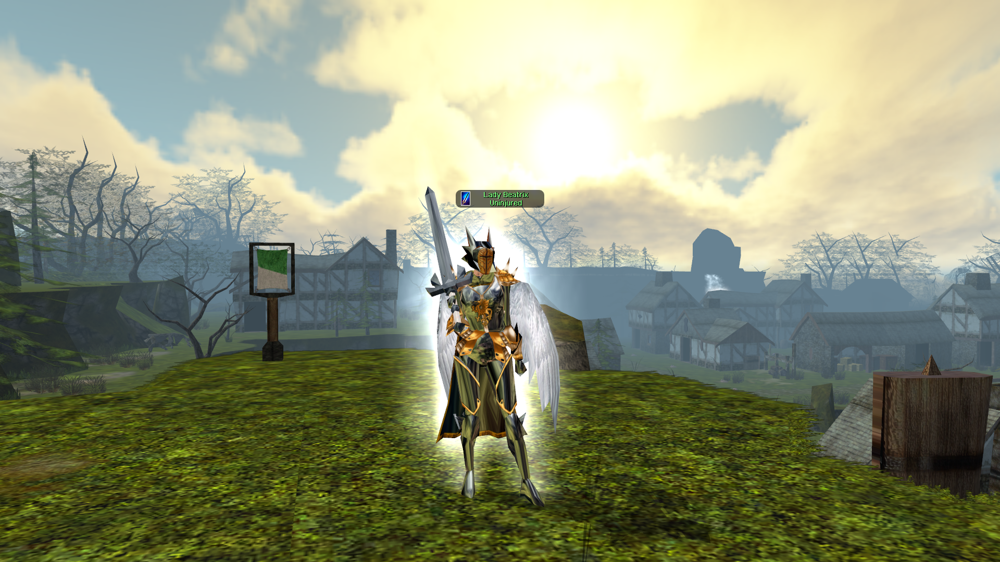

<html>
<body>
<h2>NS4 Run Logs</h2>

<a href="(EPW)DragonEyrieOct11.html">(EPW) Dragon Eyrie - Oct 11 2017</a> 
<a href="(Random)DWPOct9.html">(PickUp) Demon Web Pits - Oct 9 2017</a>

<h2>Useful Links</h2>

<a href="http://www.nsrealm.com/ns4wiki/index.php?title=Main_Page">Neversummer 4 Wiki</a> 
<a href="http://www.nsrealm.com/public/ns/viewforum.php?f=139">Neversummer 4 Forum</a> 
<a href="http://docs.google.com/leaf?id=0B-1YYCjvNejCNzQyMzBhMGYtNGUwZi00OWM1LWFmZmUtZmJjZDhhZGY2ZTQ2&hl=en"> YAL - Yet Another Logger by Claus Ekstroem. Edits by Illandous. </a> 
<a href="https://neverwintervault.org/project/nwn1/hakpak/tileset/nwncq-project">NWNCQ Tileset Overrides</a> 
<a href="https://neverwintervault.org/project/nwn1/hakpak/original-hakpak/gunners-body-rebuildretexture-male-female-all-races-phenos">NWN PC Races Overrides</a> 
<a href="https://neverwintervault.org/project/nwn1/hakpak/fix-wings-tails">Wings/Tails + Cloaks</a> 
Personally I like the basic NWNCQ Override package with all the content in the extras folder added (interior ceilings). Backup your overrides folder before making changes just incase anything goes strange! Not reccomended for multiboxing clients.

</body>
</html>
